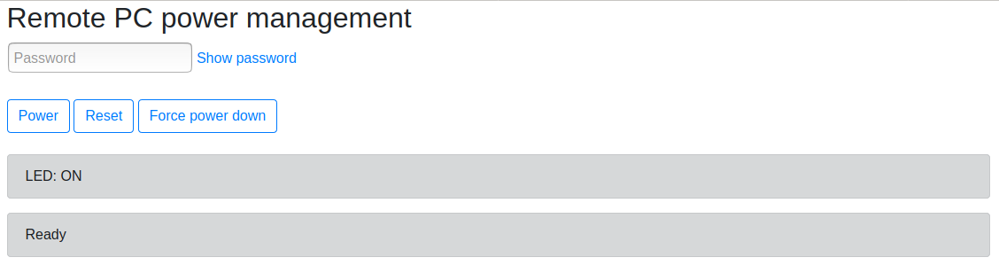

# PCSwitchPi
Control PC power buttons (power/reset/force power down) using a raspberry pi through Web interface

This is a simple Python utility for Raspberry PI to press power or reset button on remote PC using a web interface. Power and Reset button pins of the controlled PC should be connected to Raspberry Pi GPIO port as the config file.

## Usage:<br/>
Install required unities:<br/>
```bash
pip3 install -r requirements.txt
```
Run it:<br/>
```bash
python3 main.py
```
Web interface:<br/>
```
ip:port/control
eg:127.0.0.1:8081/control
```
- Screenshot:
<br/>
Listening ip/port, password, GPIO number for power_pin, reset_pin, status_pin, base_uri can be changed in the default.config file.<br>

## Connection schematics:<br/>
Refer to <a href="https://github.com/xtensa/PyControlPC" title="PyControlPC">PyControlPC</a> by xtensa, similar connection configurations.<br>
